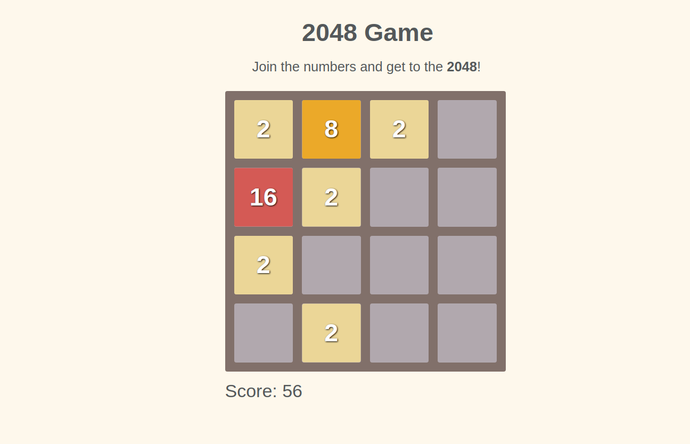

## 2048 GAME

<p align="center">
  
</p>

2048 is a single-player sliding block puzzle game designed by Gabriele Cirulli. The game's objective is to slide numbered tiles on a grid to combine them to create a tile with the number 2048. This project is a 2048 clone.

### **Features**

- Two random numbers between 2 and 4 are generated and placed randomly in the grid. There is more probability to get a 2 than a 4.
- With the keyboard arrows, you lead the direction which the tiles are goint to join.
- When two numbers are equals, the value is added to one of the tile and empty the other. For example, if the direction selected is to the left, the left tile value will be the double and the right will be none. You play with powers of two.
- Every time the player makes a movement, a sound is played and another random number is placed in a random place.
- The game is over when there are no more empty spaces nor movements availables.
- If you achieve to get 2048 number, you win!

### **Usage**

To run the game in local, I have included Serve, a local server from an NPM library.

- Install Node.js at the terminal if you haven't yet (https://nodejs.org/es/). Commands for Ubuntu:

```bash
sudo apt-get update
sudo apt-get install nodejs
```
- You will need to install the package manager npm:

```bash
sudo apt-get install npm
```
- Clone or download the repository in your computer.

```bash
git clone https://github.com/diana-moreno/2048-game.git`
```
- Download the npm competitions in your own repository and start it.

```bash
npm install serve
npm start
```
- Open the project trought the links are provided by the server.

```
   │   Serving!                                        │
   │                                                   │
   │   - Local:            http://localhost:5000       │
   │   - On Your Network:  http://192.168.1.174:5000   │
   │                                                   │
   │   Copied local address to clipboard!          │
```
- Otherside, you can run the project here: https://diana-moreno.github.io/2048-game/

### **What I learned**

- Understand the 2048 game dynamics.
- Create the logic of the game using JavaScript classes and prototypes.
- Separate the logic of the game from the JavaScript DOM operations.
- Create HTML elements and classes dynamically with JS.
- Make logic code independent, working properly in the Browser console.
- Create a grid layout with absolute positions and floats.

### **Resources**

- Original game created by [Gabriele Cirulli](https://play2048.co/)
- Sound from [ion.sound](https://github.com/IonDen/ion.sound)
